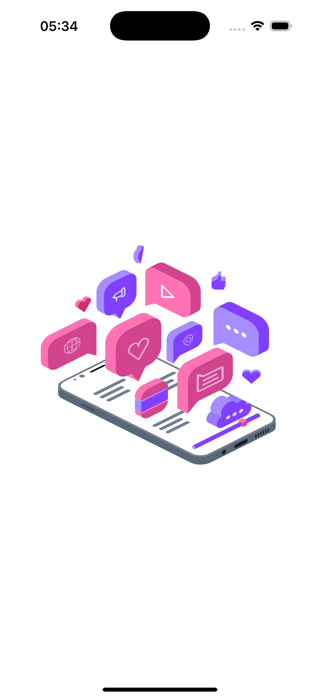
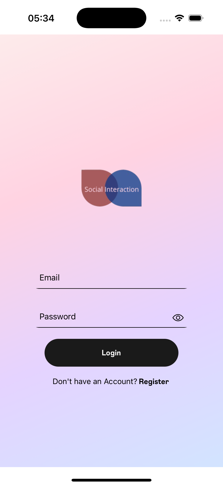
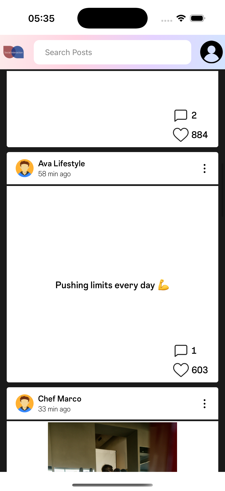
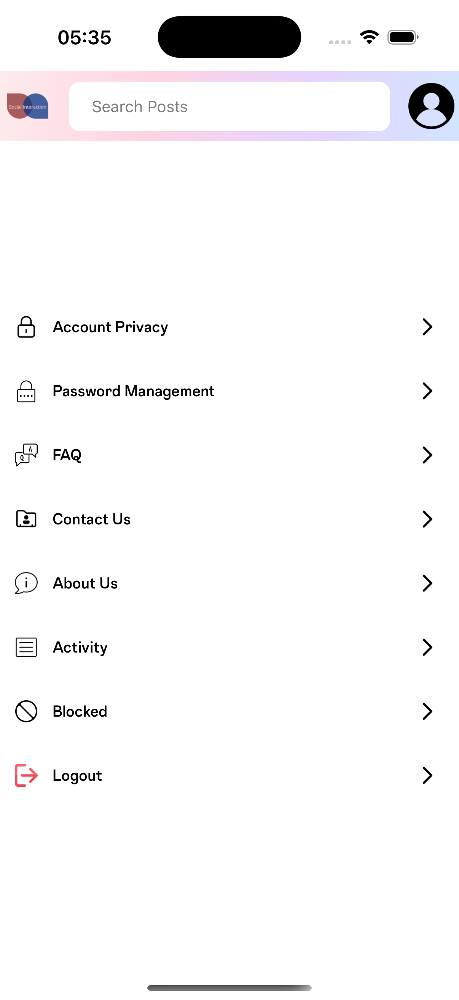
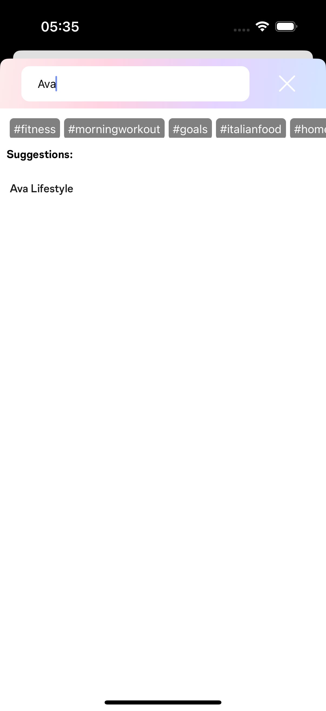
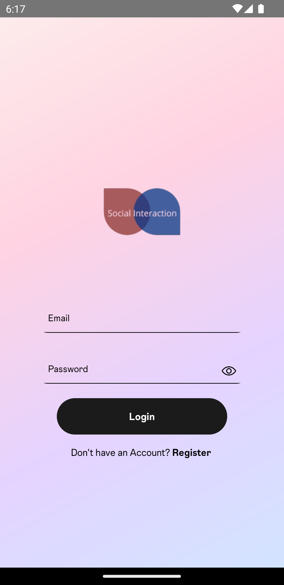

# 📱 social Media App

A fully-featured **React Native social media application** built using TypeScript, Redux Toolkit, and React Navigation. This project is structured following atomic design principles and supports both Android and iOS platforms.

---

## 🚀 Features

- 📸 Post feed & user profiles
- 🔍 Search functionality
- 🔐 Authentication flows
- 🧠 Redux Toolkit for state management
- ⚠️ Error boundaries with Sentry
- 🎨 Theming and responsive UI
- 🧪 Unit testing with Jest
- 📦 Modular and scalable architecture
- 📡 JSON Server used for mock posts data
- ✅ Context API for Theme Switching

---

## 📁 Project Structure

```bash
social-media-app-react-native/
├── mock/                   # Mock data (e.g., posts.json)
├── src/
│   ├── api/                # API calls
│   ├── assets/             # Images, fonts, etc.
│   ├── common/             # Common utilities or components
│   ├── components/
│   │   ├── atoms/          # Smallest components
│   │   ├── molecules/
│   │   └── organisms/
│   ├── constants/          # App-wide constants
│   ├── navigation/         # Navigation setup
│   ├── screens/            # Screen-level components
│   ├── services/           # Business logic / service layers
│   ├── shared/             # Shared types/utilities
│   ├── store/              # Redux Toolkit store and slices
│   ├── theme/              # Theming and styles
│   ├── types/              # Global types
│   └── utils/              # Utility functions
├── App.tsx                 # Entry point
├── .env                    # Environment variables
└── README.md
```

---

## 🧰 Tech Stack

- **React Native** `v0.79.2`
- **React** `v19`
- **TypeScript** `v5`
- **Redux Toolkit** `@reduxjs/toolkit`
- **React Navigation** (stack/native-stack)
- **Sentry** for error tracking
- **Lottie** animations
- **FlashList** for performant lists
- **JSON Server** for mock API
- **Husky** Git hooks to enforce code quality and pre-commit checks.
- **AsyncStorage**, **ToastMessage**, **Responsive UI**, and more

---

## ⚠️ Error Boundary

```tsx
// src/components/error/ErrorBoundary.tsx

import * as Sentry from "@sentry/react-native";
import React from "react";
import ErrorFallback from "../error-fallback";

type ErrorBoundaryProps = {
  children: React.ReactNode;
};

const ErrorBoundary: React.FC<ErrorBoundaryProps> = ({ children }) => {
  return (
    <Sentry.ErrorBoundary fallback={<ErrorFallback />}>
      {children}
    </Sentry.ErrorBoundary>
  );
};

export default ErrorBoundary;
```

---

## 📸 iOS Demo Video

[Watch the demo video](./src/assets/demo-videos/ios-demo.mov)

## 📸 iOS Screenshots


### 🏠 Splash Screen


### 🏠 Login Screen


### 🏠 Home Screen




### 👤 Profile Screen


### 🔍 Search Screen



---

---

## 📸 Android Screenshots


###  Splash Screen


###  Login Screen


### 🏠 Home Screen


---

## 📦 Installation

```bash
git clone https://github.com/Eddy118/social-media-app-react-native.git
cd social-media-app-react-native
npm install
```

---

## 📱 Running the App

### Android
```bash
npm run android
```

### iOS
```bash
npm run ios
```

### Start Metro
```bash
npm start
```

---

## 🧪 Testing

```bash
npm test
```

---

## 🧬 Mock API with JSON Server

```bash
npm install -g json-server

# Start JSON server
npx json-server ./mock/data/posts.json
```

---

## ✅ Environment Setup

```bash
cp .env.example .env
```

---
